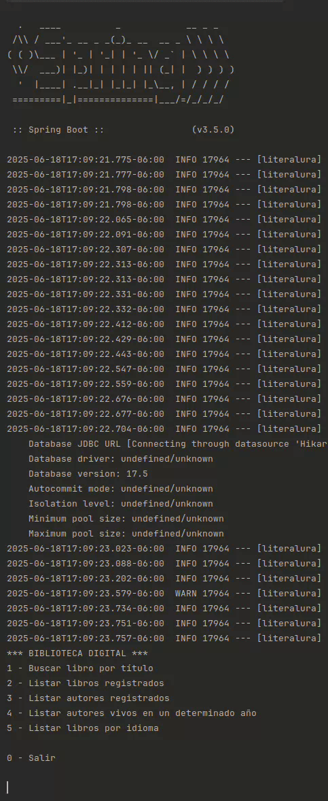

# LiterAlura 📚


---

Aplicación de consola desarrollada con Java y Spring Boot que permite interactuar con la API de [Gutendex](https://gutendex.com/) para buscar libros, guardar sus datos en una base de datos local PostgreSQL y realizar diversas consultas personalizadas.

---

## ✨ Funcionalidades

- 🔍 Buscar libros por título en la API y almacenarlos en la base de datos.
- 📚 Listar libros registrados localmente.
- 👩‍💼 Listar autores registrados.
- 🧓 Listar autores vivos en un año específico.
- 🌐 Listar libros según idioma (Español, Inglés, Francés, Portugués).

---

## 🧱 Estructura del Proyecto

El proyecto está dividido en los siguientes paquetes:

- `model`: Clases de entidad y records para mapear datos del JSON y la base de datos.
- `repository`: Interfaces JPA para manejar las consultas.
- `service`: Clases para consumir y convertir datos de la API.
- `principal`: Contiene el menú interactivo de la aplicación.

---

## 🛠️ Tecnologías Utilizadas

- Java 17
- Spring Boot
- Spring Data JPA
- PostgreSQL
- Maven
- IntelliJ IDEA

---

## ⚙️ Configuración Inicial

1. Clona este repositorio:
   ```bash
   git clone https://github.com/JenniferButanda/LiterAlura.git
   cd LiterAlura
   
2. Crea una base de datos local en PostgreSQL.

    Configura las variables de entorno desde IntelliJ:

        DB_HOST

        DB_NAME

        DB_USER

        DB_PASSWORD

3. Asegúrate de que tu archivo application.properties apunte a las variables de entorno.

4. Ejecuta la aplicación desde la clase LiteraluraApplication.

---

## 📥 API utilizada

    Gutendex API – Datos abiertos del Proyecto Gutenberg.

---

## 🧪 Ejemplo de uso

*** BIBLIOTECA DIGITAL ***
1. Buscar libro por título
2. Listar libros registrados
3. Listar autores registrados
4. Listar autores vivos en un determinado año
5. Listar libros por idioma

   0. Salir



---

## 🧠 Aprendizajes

- Consumo de APIs REST con Java y manejo de JSON usando Jackson.

- Mapeo de relaciones ManyToMany con JPA.

- Configuración de entornos seguros con variables de entorno.

- Persistencia de datos con PostgreSQL.

- Control de versiones con Git y GitHub.

---

## 📌 Notas

- Esta es una versión en consola. A futuro se planea:

- Subir la base de datos a la nube.

- Crear una interfaz gráfica o web como frontend.

- Hacerla parte de un portafolio interactivo.

---

## Contacto

Si tienes dudas, comentarios o sugerencias, puedes escribirme a:  
📧 **butandajenny@gmail.com**

---

## Autores

- **Jennifer Butanda**  
  Estudiante del área Back-End  
  Bootcamp Oracle + Alura Latam

---

## Licencia

Este proyecto está licenciado bajo la [Licencia MIT]([https://opensource.org/licenses/MIT](https://github.com/JenniferButanda/ConversorDeMonedas/blob/main/LICENSE)).  
Eres libre de usar, copiar, modificar y distribuir este código, siempre y cuando mantengas la atribución original.

---

  
